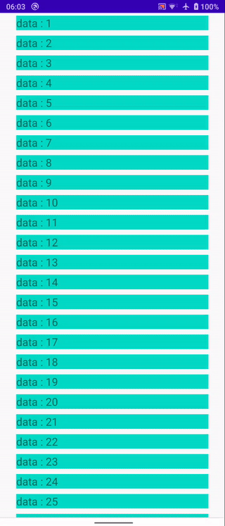

BouncyRecyclerView adds overscroll effect to RecyclerView and supports drag & drop and swiping gestures

 

Use as normal RecyclerView. Place it in your layout:

```xml
<com.valkriaine.factor.BouncyRecyclerView
        android:id="@+id/recycler_view"
        android:layout_width="match_parent"
        android:layout_height="match_parent"
        app:fling_bounce_animation_size=".5"
        app:overscroll_bounce_animation_size=".5"
        app:allow_drag_reorder="true"
        app:allow_item_swipe="false"/>
```

set up layout manager and adapter: 
```java
   recycler_view.setAdapter(myAdapter);
   recycler_view.setLayoutManager(new LinearLayoutManager(context));
```

```fling_bounce_animation_size``` specifies the magnitude of overscroll effect for fling, default is 0.5 if no value is given
```overscroll_bounce_animation_size``` specifies the magnitude of overscroll effect for drag, default is 0.5 if no value is given

```allow_drag_reorder``` and ```allow_item_swipe``` are set to false by default. If you would like to enable these features, simply set them to true.


For drag & drop or swipe gestures to work, make your adapter extend ```BouncyRecyclerView.Adapter``` and add constructor matching parent.
(If your adapter does not extend BouncyRecyclerView.Adapter, BouncyRecyclerView will simply disable the gestures)
```java
public class MyAdapter extends BouncyRecyclerView.Adapter
{
    private ArrayList<Data> dataList;

    // constructor matching parent
    public MyAdapter(ArrayList<Data> dataList)
    {
        super(dataList);
        this.dataList = dataList;
    }
    
    // override onCreateViewHolder, onBindViewHolder, and getItemCount as usual
    
    
    // override item touch callbacks: 
    
    @Override
    public void onItemSwipedToStart(@Nullable RecyclerView.ViewHolder viewHolder, int position)
    {
        //swiped to start (to left)
    }

    @Override
    public void onItemSwipedToEnd(@Nullable RecyclerView.ViewHolder viewHolder, int position)
    {
        //swiped to end (to right)
    }

    @Override
    public void onItemSelected(@Nullable RecyclerView.ViewHolder viewHolder)
    {
        //when item is long pressed
    }

    @Override
    public void onItemReleased(@Nullable RecyclerView.ViewHolder viewHolder)
    {
        //when item is released
    }

    
    // ********must override this if you want to save your data after reorder
    @Override
    public void onItemMoved(int fromPosition, int toPosition)
    {
        super.onItemMoved(fromPosition, toPosition);
        //repeatedly called when item is dragged
    }
}
```
Note that onItemMoved() will not be added when you alt-enter to implement methods. You must manually override onItemMoved() to save the reordered data set with drag & drop, otherwise RecyclerView would not persist the changes.
